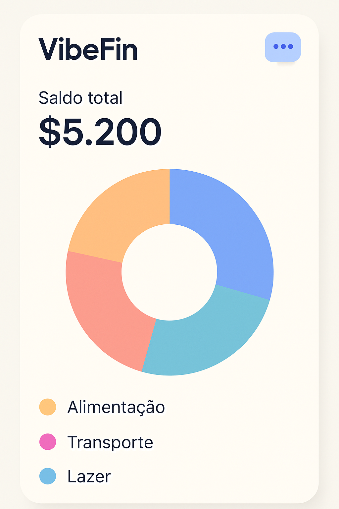

# 💸 App de Organização de Finanças Pessoais com Vibe Coding - VibeFin

Este projeto é a entrega do desafio **DIO Lab Vibe Coding App Finanças**, focado em aplicar o conceito de **Vibe Coding** para criar o conceito de um MVP (Produto Mínimo Viável) de um aplicativo de finanças pessoais conversacional.

O foco não é o código, mas sim a **clareza e a intenção** na comunicação com a Inteligência Artificial, simulando a criação de um PRD (Product Requirements Document) de alto nível.

---

## 🎯 Resumo do Conceito do App: VibeFin

O **VibeFin** é um assistente financeiro conversacional desenhado para **iniciantes**. Sua proposta de valor é eliminar a fricção do controle de gastos, transformando o registro manual em uma conversa simples e natural.

O Agente Financeiro do VibeFin atua como um educador gentil, focado exclusivamente em ajudar o usuário a registrar, entender e melhorar seus hábitos de gasto, sem jargões complexos ou funcionalidades que intimidam.

| Característica | Descrição |
| :--- | :--- |
| **Foco Principal** | Registro de gastos via chat em linguagem natural. |
| **Público-Alvo** | Iniciantes em organização financeira. |
| **Diferencial** | Experiência 100% conversacional e educativa. |
| **Hipótese Central** | A simplicidade do chat aumenta a frequência e a consistência do registro de gastos. |

### 🖼️ Simulação de Interações e Telas (Interações com IA)

As imagens abaixo simulam o resultado da interação com uma IA (como Copilot ou Lovable), que geraria o conceito visual e o fluxo de conversa com base no PRD.

#### 1. Tela Principal: Chat e Registro de Gastos

O fluxo central do VibeFin é o chat. O usuário simplesmente digita o que gastou, e o Agente Financeiro (a IA) registra, categoriza e fornece feedback imediato.

#### 2. Dashboard: Visão Resumida e Visual

O Dashboard oferece uma visão rápida e visual dos gastos, mantendo a simplicidade e evitando a complexidade de planilhas.

---

## 📝 Meu Prompt Final (PRD)

O prompt abaixo foi o documento de requisitos (PRD) final utilizado para guiar a IA na criação do conceito do MVP. Ele foi lapidado para ser um **"Prompt Investor-Ready"**, focado em clareza de escopo e proposta de valor.

\`\`\`txt
Aja como um Head de Produto, Especialista em UX Conversacional e Educador Financeiro para iniciantes, com experiência em criação de MVPs SaaS e produtos digitais validados por usuários reais.

Sua missão é criar um plano de MVP claro, realista e estratégico para um aplicativo de Organização de Finanças Pessoais baseado em conversas, com foco exclusivo em controle de gastos.

Este MVP foi pensado para:
Testar rapidamente valor para o usuário
Validar engajamento via conversa
Servir como base sólida para evolução futura

⚠️ Este produto NÃO É:
Um banco digital
Um sistema de investimentos
Um planejador financeiro completo
Uma consultoria financeira

Ele é um assistente conversacional simples e educativo, criado para ajudar iniciantes a registrar, entender e melhorar seus hábitos de gasto.

Antes de gerar a resposta final, estruture seu raciocínio passo a passo internamente, conectando:
Problema real do usuário
Momento-chave de uso
Proposta de valor do MVP
Experiência conversacional
Limites claros de escopo
Somente depois entregue o plano final.

📌 Contexto Estratégico do Produto
A maioria das pessoas não controla seus gastos porque os aplicativos existentes exigem:
Entrada manual excessiva
Interfaces complexas
Falta de personalização e orientação

Este produto resolve esse problema usando conversas em linguagem natural, permitindo que o usuário registre gastos imediatamente após realizá-los, de forma rápida e sem fricção.

Momento-chave prioritário do usuário
“Acabei de gastar dinheiro e quero registrar isso agora, sem esforço.”

O público-alvo são pessoas iniciantes em organização financeira, que:
Nunca mantiveram controle consistente de gastos
Se sentem intimidadas por apps financeiros tradicionais
Precisam aprender enquanto usam o produto

🤖 Agente Financeiro — Princípios de Comportamento
O aplicativo possui um Agente Financeiro, que funciona como o principal diferencial do produto.
Esse agente:
Comunica-se de forma educativa, didática, prática e direta
Usa linguagem simples, sem jargões financeiros
Faz perguntas curtas e objetivas
Dá feedbacks e alertas de forma gentil e não julgadora
Ajuda o usuário a aprender hábitos financeiros aos poucos
Prioriza sempre clareza, confiança e simplicidade

🎯 Objetivo do Output
Gerar um plano de MVP pronto para avaliação de produto, que demonstre:
Clareza de proposta de valor
Foco no problema certo
Disciplina de escopo
Viabilidade de execução
Potencial de evolução futura

✅ Funcionalidades obrigatórias do MVP
Você DEVE considerar apenas as funcionalidades abaixo, deixando claro que são suficientes para validação inicial:
Registro de gastos via conversa em linguagem natural (fluxo central do MVP)
Classificação automática simples de gastos
Definição e acompanhamento de metas de gastos
Recomendações básicas de economia geradas pelo Agente Financeiro
Relatórios simples, visuais e personalizados
Arquitetura conceitual preparada para integrações futuras (bancos e Open Finance)

🧩 Estrutura obrigatória da resposta
Siga rigorosamente a estrutura abaixo.
Não misture MVP com funcionalidades futuras.

1. Visão Geral do MVP (Proposta de Valor)
Explique de forma clara:
Qual problema central o MVP resolve
Para quem ele foi criado
Por que a experiência conversacional é o diferencial
Qual hipótese principal este MVP pretende validar

2. Principais Telas do MVP
Liste e descreva as telas essenciais, como:
Chat principal
Visão resumida de gastos
Metas de gastos
Relatórios simples
Explique o papel de cada tela do ponto de vista do usuário.

3. Fluxo Principal do MVP (Core Flow)
Descreva detalhadamente o fluxo de registro de gastos, incluindo:
Contexto do usuário
Mensagem enviada
Interação do Agente Financeiro
Confirmação do registro
Inclua exemplos reais de diálogo, demonstrando clareza, tom humano e baixo atrito.

4. Fluxos Conversacionais Secundários
Inclua exemplos de:
Feedback automático sobre padrões de gasto
Dicas simples de economia
Acompanhamento de metas
Sempre reforçando aprendizado e não julgamento.

5. Recursos e Lógicas Necessárias
Explique, de forma acessível:
Como a IA entende mensagens do usuário
Como categoriza gastos
Como gera insights simples
Como mantém histórico financeiro
Evite qualquer detalhe técnico profundo.

6. O que NÃO entra no MVP (Disciplina de Escopo)
Liste claramente:
Funcionalidades propositalmente excluídas
Complexidades adiadas
Motivos estratégicos para manter o MVP enxuto

7. Evolução do Produto (Pós-MVP)
Explique apenas de forma conceitual como o produto pode evoluir com:
Integrações bancárias
Open Finance
Automação mais avançada
Deixe explícito que isso não faz parte da validação inicial.

8. Estratégia de Validação
Explique como validar o MVP com baixo custo e rapidez, incluindo:
Tipos de testes com usuários
Simulações de conversa
Métricas iniciais relevantes (ex: frequência de uso, retenção, clareza percebida)

9. Limitações e Riscos
Aponte:
Limitações naturais do MVP
Riscos de UX conversacional
Expectativas que precisam ser bem comunicadas ao usuário

10. Checklist Executivo do MVP
Finalize com uma checklist objetiva, confirmando se o MVP está pronto para:
Testes reais
Apresentação a stakeholders
Aprendizado rápido e iteração

📏 Critérios de Qualidade
Antes de finalizar, valide se o plano:
É fácil de entender para iniciantes
Demonstra foco e disciplina de produto
Prioriza o fluxo central de registro de gastos
Evita jargões técnicos
Mantém escopo claro e viável

🗣 Diretrizes de Linguagem
Português claro, profissional e acessível
Tom educativo, humano e confiante
Linguagem de produto real, não acadêmica
Não mencionar investimentos

O resultado final deve transmitir a sensação de um MVP bem pensado, executável e pronto para validação real.
\`\`\`

---

## 💡 Reflexão sobre o Processo (Vibe Coding)

O processo de Vibe Coding, focado na criação de um PRD detalhado antes de qualquer código, provou ser extremamente eficaz para garantir a **disciplina de escopo** e a **clareza da intenção**.

| O que funcionou bem | O que não funcionou como o esperado | O que aprendi sobre conversar com IAs |
| :--- | :--- | :--- |
| **Clareza do Escopo:** O prompt final, ao listar explicitamente o que *não* entra no MVP, forçou a IA a focar no fluxo central (registro de gastos), resultando em um conceito enxuto e validável. | **Geração de Imagens:** A IA de geração de imagens precisou de prompts muito específicos para simular uma interface de chat e dashboard de forma coerente com o conceito de "simplicidade para iniciantes". | **A Intenção é o Algoritmo:** A qualidade da saída da IA está diretamente ligada à clareza da intenção. O prompt não é apenas um pedido, é um **documento de requisitos** que define a "vibe" do produto. |
| **Definição da Persona:** A descrição detalhada do "Agente Financeiro" (educativo, não julgador) garantiu que o tom de voz do app fosse consistente com o público-alvo (iniciantes). | **Simulação de Diálogo:** A simulação de diálogos complexos exigiu múltiplas iterações no prompt, pois a IA tende a ser muito formal. Foi necessário reforçar o tom "humano" e "gentil" do agente. | **IA como Head de Produto:** Ao pedir para a IA agir como um "Head de Produto", ela automaticamente aplicou princípios de negócio (viabilidade, validação, evolução), elevando a qualidade do planejamento. |

Em resumo, o Vibe Coding é uma poderosa ferramenta para transformar ideias em **planos de ação concretos**, usando a IA como um parceiro estratégico na fase de concepção e planejamento do produto.
